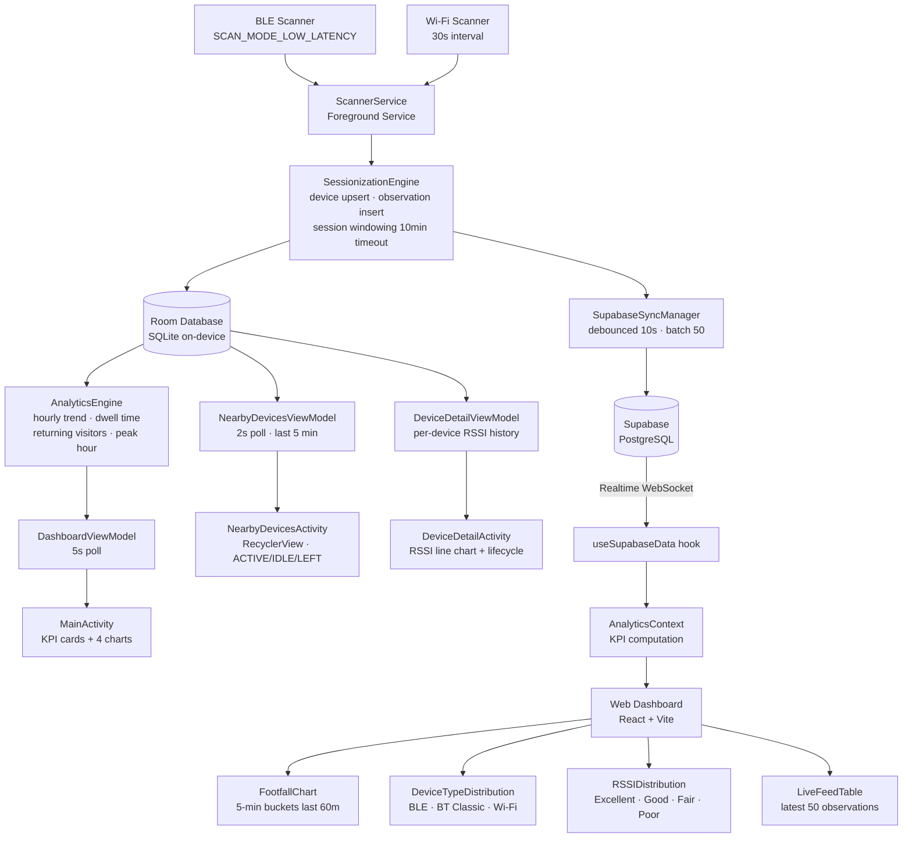

<div align="center">

# Footfall Analytics

### Passive device detection and footfall analysis for physical spaces


</div>

---

## Overview

Footfall Analytics is a two-part system that measures how many people pass by or linger near a physical location — such as a billboard, retail storefront, or event venue — by passively detecting the Bluetooth and Wi-Fi signals emitted by their personal devices.

**The problem it solves:** Traditional footfall counters use cameras or infrared beams that require line-of-sight installation. This system requires only an Android phone or tablet placed near the target location. No cameras, no infrastructure changes, no privacy invasion — just RF signal detection.

**Why Bluetooth and Wi-Fi:** Almost every person carries a smartphone that continuously broadcasts Bluetooth Low Energy (BLE) advertising packets and Wi-Fi probe requests. These signals are detectable at distances of 10–30 metres and contain a MAC address that can be used as an anonymous device identifier.

**How analytics are generated:** The Android app collects raw detections, groups them into visits (sessions) using a 10-minute inactivity timeout, and computes aggregated metrics — unique visitors, average dwell time, returning visitors, peak hours, and signal strength distribution. These metrics are displayed on the device and synced to a cloud-hosted web dashboard in real time via Supabase.

---

## Project Summary

| Property | Value |
|----------|-------|
| Project Name | BillboardAnalytics (Footfall Tracker) |
| Package | `com.example.billboardanalytics` |
| Min SDK | API 30 (Android 11) |
| Target SDK | API 35 |
| Architecture | MVVM + Foreground Service |
| Local Database | Room (SQLite) v2.6.0 |
| Cloud Database | Supabase (PostgreSQL) |
| Android Language | Java 1.8 |
| Dashboard Language | TypeScript + React 19 |
| Build System | Gradle 8.1.1 |

---

## Features

✅ **BLE Continuous Scanning** — Runs a low-latency BLE scan (`SCAN_MODE_LOW_LATENCY`) that detects nearby Bluetooth Low Energy devices in real time. Captures raw advertisement bytes and manufacturer-specific data.

✅ **Wi-Fi Access Point Scanning** — Scans for nearby Wi-Fi access points every 30 seconds (respecting Android OS throttling). Captures BSSID, SSID, signal level, and frequency band.

✅ **Background Foreground Service** — Scanning runs inside a persistent foreground service with a permanent notification (`START_STICKY`), surviving app minimisation. Declares both `location` and `connectedDevice` foreground service types for Android 14+ compliance.

✅ **Auto-Start on Boot** — A `BroadcastReceiver` listens for `BOOT_COMPLETED` and `QUICKBOOT_POWERON` to restart the scanner service automatically after device reboot.

✅ **Session-Based Visit Tracking** — A sessionization engine converts raw detections into structured visits. A session starts on first detection of a device and ends after 10 minutes of absence. Duration is tracked in milliseconds.

✅ **Local Room Database** — All data is persisted on-device in a SQLite database via Room with three tables: `devices`, `observations`, and `sessions`. Foreign key constraints with CASCADE DELETE ensure referential integrity.

✅ **Live Dashboard (Android)** — `MainActivity` displays 5 KPI cards (current devices, today's total, returning visitors, average dwell time, peak activity) and 4 live charts: hourly bar chart, last-5-minutes line chart, device category pie chart, and protocol distribution pie chart. Polls every 5 seconds.

✅ **Live Devices Screen** — `NearbyDevicesActivity` shows a RecyclerView of devices seen in the last 5 minutes, each with MAC address, signal strength, estimated distance, time-since-last-seen, and an ACTIVE/IDLE/LEFT status badge. Updates every 2 seconds.

✅ **Device Detail Screen** — Tapping any device opens `DeviceDetailActivity` showing a full lifecycle profile: first seen, last seen, detection count, average RSSI, session count, total dwell time, and an interactive RSSI-over-time line chart.

✅ **Cloud Sync to Supabase** — `SupabaseSyncManager` uploads new devices and observations to Supabase via its REST API using HTTP upserts. Sync is debounced (one upload per 10 seconds maximum) to avoid flooding the network during heavy BLE scan bursts. A high-water mark in SharedPreferences ensures no rows are re-uploaded.

✅ **Manual Sync Trigger** — A "Sync Data" button in `MainActivity` sends an Intent action to the service, triggering an immediate out-of-band sync to Supabase.

✅ **Web Dashboard** — A React + Vite + TypeScript SPA that connects to Supabase and displays real-time analytics: 4 KPI cards, a footfall line chart (last 60 minutes in 5-minute buckets), a device type distribution donut chart, an RSSI signal quality bar chart, and a live observation feed showing the latest 50 detections.

✅ **Supabase Realtime** — The web dashboard subscribes to Supabase Postgres changes via WebSocket for both INSERT on `observations` and INSERT/UPDATE on `devices`, so the dashboard updates the moment new data arrives.

✅ **Debug Log Screen** — `DebugLogActivity` renders a pretty-printed JSON dump of all devices, their observation counts, and their sessions directly from the Room database. Includes a "Clear Database" button.

✅ **Data Export** — An "Export Data" button in `MainActivity` generates a plain-text analytics summary and invokes `ACTION_SEND` to share it via any installed messaging, email, or notes app.

✅ **Runtime Permissions** — `MainActivity` checks and requests all required permissions at startup, branching on Android version (API 30, API 31+, API 33+) to request only the permissions relevant to that SDK level.

✅ **Distance Estimation** — Both the Android app and the web dashboard estimate physical distance from RSSI using the standard log-distance path loss model: `d = 10 ^ ((TxPower - RSSI) / (10 × N))` with TxPower = −59 dBm and N = 2.0.

---

## Architecture



---

## Project Structure

```
BillboardAnalytics/
│
├── app/
│   └── src/main/
│       ├── java/com/example/billboardanalytics/
│       │   ├── data/
│       │   │   ├── AppDatabase.java          # Room singleton, migration registry
│       │   │   ├── AnalyticsDao.java         # All SQL queries (11 methods)
│       │   │   ├── DeviceEntity.java         # devices table
│       │   │   ├── ObservationEntity.java    # observations table
│       │   │   ├── SessionEntity.java        # sessions table
│       │   │   └── Observation.java          # In-memory scan result DTO
│       │   │
│       │   ├── engine/
│       │   │   ├── SessionizationEngine.java # Core processing pipeline
│       │   │   ├── AnalyticsEngine.java      # Metric aggregation
│       │   │   └── FootfallMetrics.java      # Metrics data class
│       │   │
│       │   ├── scanner/
│       │   │   ├── BluetoothScanner.java     # BLE scanning
│       │   │   └── WiFiScanner.java          # Wi-Fi AP scanning
│       │   │
│       │   ├── service/
│       │   │   ├── ScannerService.java       # Foreground service orchestrator
│       │   │   └── BootReceiver.java         # Auto-start on boot
│       │   │
│       │   ├── sync/
│       │   │   └── SupabaseSyncManager.java  # Debounced cloud sync
│       │   │
│       │   ├── ui/
│       │   │   ├── MainActivity.java         # Main dashboard + charts
│       │   │   ├── DashboardViewModel.java   # 5s polling ViewModel
│       │   │   ├── NearbyDevicesActivity.java
│       │   │   ├── NearbyDevicesViewModel.java
│       │   │   ├── NearbyDeviceAdapter.java
│       │   │   ├── NearbyDevice.java         # UI model
│       │   │   ├── DeviceDetailActivity.java
│       │   │   ├── DeviceDetailViewModel.java
│       │   │   └── DebugLogActivity.java
│       │   │
│       │   └── util/
│       │       └── DeviceCategory.java       # Source-of-truth for device categorisation
│       │
│       ├── res/
│       │   ├── layout/
│       │   │   ├── activity_main.xml
│       │   │   ├── activity_nearby_devices.xml
│       │   │   ├── activity_device_detail.xml
│       │   │   ├── activity_debug_log.xml
│       │   │   └── item_nearby_device.xml
│       │   ├── drawable/
│       │   │   ├── bg_badge_active.xml       # Green rounded badge
│       │   │   ├── bg_badge_idle.xml         # Amber rounded badge
│       │   │   └── bg_badge_left.xml         # Red rounded badge
│       │   └── values/
│       │       └── strings.xml               # App name + Supabase credentials
│       │
│       └── AndroidManifest.xml
│
├── billboard-dashboard/
│   └── src/
│       ├── App.tsx                           # Root layout + loading/error states
│       ├── main.tsx                          # React entry point
│       ├── contexts/
│       │   └── AnalyticsContext.tsx          # Global state + KPI computation
│       ├── hooks/
│       │   └── useSupabaseData.ts            # Fetch + Realtime subscriptions
│       ├── components/
│       │   ├── Charts.tsx                    # FootfallChart, DeviceTypeDistribution, RSSIDistribution
│       │   ├── KPICard.tsx                   # Metric tile
│       │   └── LiveFeedTable.tsx             # Latest 50 observations feed
│       ├── lib/
│       │   ├── supabase.ts                   # Supabase client init
│       │   └── utils.ts                      # cn(), estimateDistance(), formatTimeAgo()
│       └── types/
│           └── supabase.ts                   # TypeScript DB schema types
│
└── supabase/
    └── migrations/
        └── 00001_create_tables.sql           # Cloud schema + indexes
```

---

## Database Schema

### On-Device (Room / SQLite)

| Table | Purpose | Key Fields |
|-------|---------|------------|
| `devices` | One row per unique MAC/BSSID ever seen | `id` (PK), `device_identifier` (unique), `source` (BLE/BT_CLASSIC/WIFI), `first_seen`, `last_seen` (ISO-8601 UTC) |
| `observations` | One row per individual scan detection | `id` (PK), `device_id` (FK→devices), `timestamp`, `rssi`, `source` |
| `sessions` | One row per continuous presence window | `id` (PK), `device_id` (FK→devices), `start_time`, `end_time`, `duration` (ms) |

All foreign keys have `ON DELETE CASCADE`.
Indexes: `device_identifier` (unique), `device_id` on observations, `device_id` on sessions.

### Cloud (Supabase / PostgreSQL)

| Table | Key Fields | Indexes |
|-------|-----------|---------|
| `devices` | `id BIGSERIAL PK`, `device_identifier TEXT NOT NULL`, `source TEXT NOT NULL`, `first_seen TIMESTAMPTZ DEFAULT NOW()`, `last_seen TIMESTAMPTZ DEFAULT NOW()` | `idx_devices_identifier`, `idx_devices_last_seen DESC` |
| `observations` | `id BIGSERIAL PK`, `device_id BIGINT FK→devices NOT NULL`, `timestamp TIMESTAMPTZ DEFAULT NOW()`, `rssi INTEGER NOT NULL`, `source TEXT NOT NULL` | `idx_observations_timestamp DESC`, `idx_observations_device_id` |
| `sessions` | `id BIGSERIAL PK`, `device_id BIGINT FK→devices NOT NULL`, `start_time TIMESTAMPTZ DEFAULT NOW()`, `end_time TIMESTAMPTZ DEFAULT NOW()`, `duration BIGINT NOT NULL DEFAULT 0` | `idx_sessions_device_id`, `idx_sessions_start_time DESC` |

> The cloud schema mirrors the on-device schema with all three tables (`devices`, `observations`, `sessions`) for accurate analytics syncing.

---

## Core Modules

<details>
<summary><strong>BluetoothScanner</strong></summary>

Runs a BLE scan using `BluetoothLeScanner` with `SCAN_MODE_LOW_LATENCY` for maximum detection rate. On each scan result, it captures the device's MAC address, RSSI, raw advertisement bytes, and manufacturer-specific data (in hex). Handles both individual `onScanResult` callbacks and batched `onBatchScanResults`. Classic BT discovery is not used in the current build — only BLE.

</details>

<details>
<summary><strong>WiFiScanner</strong></summary>

Uses `WifiManager.startScan()` with a `BroadcastReceiver` listening for `SCAN_RESULTS_AVAILABLE_ACTION`. After each result, it re-schedules the next scan 30 seconds later via a `Handler` — respecting Android 9+ OS throttling limits (maximum 4 scans per 2 minutes). Captures BSSID, SSID, signal level, and frequency for each visible access point.

</details>

<details>
<summary><strong>SessionizationEngine</strong></summary>

The core processing pipeline. Every detection calls `processDetection(identifier, source, rssi)` on a single-threaded executor to ensure serialised DB writes. Steps:

1. `getDeviceByIdentifier()` — fetch or create the device record, handling the race condition where two threads try to insert the same MAC simultaneously.
2. `insertObservation()` — write a timestamped RSSI reading.
3. `getLatestSessionForDevice()` — check the most recent session. If it ended more than 10 minutes ago (or doesn't exist), create a new one. Otherwise, extend the existing session's `end_time` and recalculate `duration`.
4. `syncAsync()` — trigger a debounced Supabase upload.

</details>

<details>
<summary><strong>AnalyticsEngine</strong></summary>

Runs on a background thread (polled every 5 seconds by `DashboardViewModel`). Computes for the current UTC day:

- **Total visitors** — unique `device_id` values across all today's sessions
- **Current nearby** — distinct devices with an observation in the last 5 minutes
- **Returning visitors** — devices whose `first_seen` predates today
- **Average dwell time** — mean session duration in milliseconds
- **Peak hour** — hour 0–23 with the most session starts; reports minutes elapsed since its centre (HH:30)
- **Hourly trend** — sessions per hour (0–23) as a `Map<Integer, Integer>`
- **Last 5 minutes trend** — unique devices overlapping each of the last 5 one-minute buckets
- **Source distribution** — count of Bluetooth vs Wi-Fi devices
- **Category distribution** — Phones, Audio, Laptop, Watches, Router/AP (resolved via `DeviceCategory`)

</details>

<details>
<summary><strong>SupabaseSyncManager</strong></summary>

Uploads Room data to Supabase using its REST API with `Prefer: resolution=merge-duplicates` (upsert semantics). Two sync paths:

- **Devices** — full table upsert on every sync cycle (device count stays small)
- **Observations** — incremental upload using a high-water mark stored in `SharedPreferences` (`last_synced_obs_id`). Fetches up to 50 rows per batch in ascending `id` order. The watermark is only advanced after a confirmed 2xx HTTP response, so failures always retry.

Sync is debounced via a `ScheduledExecutorService`: each call to `syncAsync()` cancels the previous pending task and reschedules it 10 seconds later, collapsing continuous BLE scan bursts into at most one network call per 10 seconds.

</details>

<details>
<summary><strong>Web Dashboard</strong></summary>

A React 19 SPA built with Vite and styled with Tailwind CSS v4. Data flows from Supabase through a single `useSupabaseData` hook into `AnalyticsContext`, which exposes computed KPIs to all components via React Context.

Initial load fetches the last 24 hours of observations (≤5,000 rows) and all devices in parallel. Supabase Realtime WebSocket subscriptions then push INSERT events for new observations and INSERT/UPDATE events for device changes, updating state immediately without polling.

Charts are rendered with Recharts. The footfall line chart uses 5-minute aligned time buckets to correctly match observations to their bucket regardless of when the component renders.

</details>

---

## FootfallAnalytics SDK (`sdktest/`)

A standalone Android library that wraps the core scanning, sessionization, and analytics engine so third-party apps can integrate footfall detection without building their own BLE/Wi-Fi pipeline.

### SDK Module

```
sdktest/
└── src/main/java/com/footfallanalytics/sdk/
    ├── FootfallAnalyticsSDK.java    # Singleton entry point
    ├── SDKConfig.java                # Builder-pattern configuration
    ├── FootfallListener.java         # Callback interface
    ├── model/                        # Public data models
    │   ├── Observation.java          # Single detection (Gson-serializable)
    │   ├── DeviceInfo.java           # Device metadata
    │   ├── SessionInfo.java          # Visit session
    │   └── FootfallMetrics.java      # Computed analytics
    ├── scanner/                      # Internal — BLE + Wi-Fi scanning
    ├── engine/                       # Internal — sessionization + metrics
    ├── data/                         # Internal — Room database (3 entities, DAO)
    ├── sync/                         # Internal — Supabase REST uploader
    └── util/                         # Internal — OUI device categorisation
```

### Quick Start

**1. Add dependency** (after publishing or using a local AAR)

```groovy
// settings.gradle
dependencyResolutionManagement {
    repositoriesMode.set(RepositoriesMode.FAIL_ON_PROJECT_REPOS)
    repositories {
        google()
        mavenCentral()
        maven { url "https://jitpack.io" }
    }
}

// app/build.gradle
dependencies {
    implementation project(':sdktest')
    // or: implementation 'com.github.your-org:footfall-analytics-sdk:1.0.0'
}
```

**2. Initialise in your Application or Activity**

```java
SDKConfig config = new SDKConfig.Builder()
    .setSupabaseUrl("https://YOUR_PROJECT.supabase.co")
    .setSupabaseAnonKey("YOUR_ANON_KEY")
    .build();

FootfallAnalyticsSDK sdk = FootfallAnalyticsSDK.getInstance();
sdk.initialize(this, config);
sdk.setListener(new FootfallListener() {
    @Override public void onObservationDetected(Observation obs) { }
    @Override public void onMetricsUpdated(FootfallMetrics metrics) { }
    @Override public void onScanningStarted() { }
    @Override public void onScanningStopped() { }
    @Override public void onError(String msg, Throwable cause) { }
});
```

**3. Start / stop scanning**

```java
sdk.startScanning();  // Begins BLE + Wi-Fi scanning
// ...
FootfallMetrics metrics = sdk.getMetrics();  // One-shot query
// ...
sdk.stopScanning();
sdk.shutdown();
```

### Public API Reference

| Method | Description |
|--------|-------------|
| `getInstance()` | Returns the singleton instance |
| `initialize(context, config)` | Initialises Room DB, scanners, engine, and sync |
| `setListener(listener)` | Registers a `FootfallListener` for callbacks |
| `startScanning()` | Starts BLE + Wi-Fi scanning + 5-second metrics polling |
| `stopScanning()` | Stops all scanners and polling |
| `isScanning()` | Returns whether scanning is active |
| `getMetrics()` | Synchronous query — computes `FootfallMetrics` for today |
| `triggerSync()` | Forces an immediate upload to Supabase |
| `shutdown()` | Stops scanning, shuts down executors, releases resources |

### SDKConfig.Builder Options

| Option | Default | Description |
|--------|---------|-------------|
| `setSupabaseUrl(url)` | `""` | Supabase project URL (omit to disable cloud sync) |
| `setSupabaseAnonKey(key)` | `""` | Supabase anonymous key |
| `setSessionTimeoutMs(ms)` | `600_000` (10 min) | Inactivity threshold for session expiry |
| `setWifiPollIntervalMs(ms)` | `15_000` (15 s) | Interval for polling Wi-Fi scan cache |
| `setClassicBtScanningEnabled(bool)` | `true` | Whether to also run classic Bluetooth discovery |

### FootfallListener Callbacks

| Callback | Fires |
|----------|-------|
| `onObservationDetected(obs)` | Each BLE / Wi-Fi / BT Classic detection (main thread) |
| `onMetricsUpdated(metrics)` | Every 5 seconds while scanning (main thread) |
| `onScanningStarted()` | After scanners begin |
| `onScanningStopped()` | After scanners stop |
| `onError(msg, cause)` | On metrics computation failure |

### Required Permissions

The SDK declares all necessary permissions in its own manifest. The host app must still **request runtime permissions** before calling `startScanning()`:

- `BLUETOOTH_SCAN` (API 31+) / `BLUETOOTH` + `BLUETOOTH_ADMIN` (API 30)
- `BLUETOOTH_CONNECT` (API 31+) — reads device names
- `ACCESS_FINE_LOCATION` — required by Android for BLE scan results
- `ACCESS_COARSE_LOCATION` — fallback
- `ACCESS_BACKGROUND_LOCATION` — scan while app is in background
- `ACCESS_WIFI_STATE` — read Wi-Fi scan cache
- `CHANGE_WIFI_STATE` — trigger Wi-Fi scans
- `INTERNET` — Supabase REST uploads

---

## Android Permissions

| Permission | Reason |
|-----------|--------|
| `ACCESS_FINE_LOCATION` | Required by Android to perform Bluetooth and Wi-Fi scanning (OS requirement since API 23) |
| `ACCESS_COARSE_LOCATION` | Fallback location permission also required for scanning APIs |
| `ACCESS_BACKGROUND_LOCATION` | Allows scanning to continue when the app is not in the foreground |
| `BLUETOOTH` / `BLUETOOTH_ADMIN` | Legacy Bluetooth permissions for API ≤ 30 |
| `BLUETOOTH_SCAN` | Bluetooth scanning permission for API 31+ |
| `BLUETOOTH_CONNECT` | Required to read device names on API 31+ |
| `ACCESS_WIFI_STATE` | Read Wi-Fi scan results |
| `CHANGE_WIFI_STATE` | Initiate Wi-Fi scans via `WifiManager.startScan()` |
| `FOREGROUND_SERVICE` | Declare the scanner as a foreground service |
| `FOREGROUND_SERVICE_LOCATION` | Android 14+ typed foreground service — location |
| `FOREGROUND_SERVICE_CONNECTED_DEVICE` | Android 14+ typed foreground service — Bluetooth |
| `RECEIVE_BOOT_COMPLETED` | Auto-start after device reboot |
| `POST_NOTIFICATIONS` | Show the persistent scanning notification on API 33+ |
| `INTERNET` | Upload data to Supabase REST API |

---

## Installation

### Android App

**Requirements**
- Android Studio Hedgehog (2023.1.1) or newer
- Android device running API 30 (Android 11) or higher
- Bluetooth and Wi-Fi enabled on the device

**Steps**

```bash
# Clone the repository
git clone https://github.com/your-username/footfall-analytics.git
cd footfall-analytics
```

1. Open the root folder in Android Studio
2. Let Gradle sync complete (`File → Sync Project with Gradle Files`)
3. Open `local.properties` at the project root and add your Supabase credentials:

```properties
SUPABASE_URL=https://YOUR_PROJECT_ID.supabase.co
SUPABASE_ANON_KEY=YOUR_SUPABASE_ANON_KEY
```

4. Connect your Android device with USB debugging enabled
5. Run the app (`Shift+F10`)

### Supabase Setup

1. Create a project at [supabase.com](https://supabase.com)
2. Open the SQL editor and run the migration:

```sql
-- From supabase/migrations/00001_create_tables.sql
CREATE TABLE devices (
    id BIGSERIAL PRIMARY KEY,
    device_identifier TEXT NOT NULL,
    source TEXT NOT NULL,
    first_seen TIMESTAMPTZ DEFAULT NOW(),
    last_seen TIMESTAMPTZ DEFAULT NOW()
);

CREATE TABLE observations (
    id BIGSERIAL PRIMARY KEY,
    device_id BIGINT NOT NULL REFERENCES devices(id) ON DELETE CASCADE,
    timestamp TIMESTAMPTZ DEFAULT NOW(),
    rssi INTEGER NOT NULL,
    source TEXT NOT NULL
);

CREATE TABLE sessions (
    id BIGSERIAL PRIMARY KEY,
    device_id BIGINT NOT NULL REFERENCES devices(id) ON DELETE CASCADE,
    start_time TIMESTAMPTZ DEFAULT NOW(),
    end_time TIMESTAMPTZ DEFAULT NOW(),
    duration BIGINT NOT NULL DEFAULT 0
);

CREATE INDEX idx_observations_timestamp ON observations(timestamp DESC);
CREATE INDEX idx_observations_device_id ON observations(device_id);
CREATE INDEX idx_sessions_device_id ON sessions(device_id);
CREATE INDEX idx_sessions_start_time ON sessions(start_time DESC);
CREATE INDEX idx_devices_identifier ON devices(device_identifier);
CREATE INDEX idx_devices_last_seen ON devices(last_seen DESC);
```

3. Enable Row Level Security and add insert policies:

```sql
ALTER TABLE devices ENABLE ROW LEVEL SECURITY;
ALTER TABLE observations ENABLE ROW LEVEL SECURITY;
ALTER TABLE sessions ENABLE ROW LEVEL SECURITY;

CREATE POLICY "anon_select_devices"      ON devices      FOR SELECT USING (true);
CREATE POLICY "anon_insert_devices"      ON devices      FOR INSERT WITH CHECK (true);
CREATE POLICY "anon_update_devices"      ON devices      FOR UPDATE USING (true);

CREATE POLICY "anon_select_observations" ON observations FOR SELECT USING (true);
CREATE POLICY "anon_insert_observations" ON observations FOR INSERT WITH CHECK (true);

CREATE POLICY "anon_select_sessions"     ON sessions     FOR SELECT USING (true);
CREATE POLICY "anon_insert_sessions"     ON sessions     FOR INSERT WITH CHECK (true);
CREATE POLICY "anon_update_sessions"     ON sessions     FOR UPDATE USING (true);
```

4. Enable Realtime for all three tables:
   - Go to **Database → Replication**
   - Toggle on `devices`, `observations`, and `sessions`

5. Copy your **Project URL** and **anon public key** from **Project Settings → API**

### Web Dashboard

```bash
cd billboard-dashboard

# Create environment file
cp .env.local.example .env.local
# Edit .env.local and add:
# VITE_SUPABASE_URL=https://YOUR_PROJECT_ID.supabase.co
# VITE_SUPABASE_ANON_KEY=YOUR_SUPABASE_ANON_KEY

# Install dependencies
npm install

# Start development server
npm run dev

# Build for production
npm run build
```

---

## Screens

### Android App

| Screen | Description |
|--------|-------------|
| **Dashboard** (`MainActivity`) | KPI cards, hourly bar chart, 5-minute line chart, category and protocol pie charts, start/stop/export/sync buttons |
| **Live Devices** (`NearbyDevicesActivity`) | Scrollable list of devices seen in the last 5 minutes with ACTIVE/IDLE/LEFT badges |
| **Device Profile** (`DeviceDetailActivity`) | Full lifecycle view for a single device — MAC, category, first/last seen, detections, average RSSI, sessions, dwell time, RSSI over time chart |
| **Debug Log** (`DebugLogActivity`) | Pretty-printed JSON of the entire Room database with a clear-all button |

### Web Dashboard

| Component | Description |
|-----------|-------------|
| **KPI Row** | Total Devices Seen · Currently Present (5m) · New Devices Today · Total Observations |
| **Footfall Chart** | Line chart of observations and unique devices across the last 60 minutes in 5-minute intervals |
| **Device Types** | Donut chart — Wi-Fi vs BLE vs BT Classic split |
| **RSSI Distribution** | Horizontal bar chart — Excellent / Good / Fair / Poor signal quality bands |
| **Live Feed** | Scrollable table of the 50 most recent observations with type icon, MAC address, RSSI bar, and estimated distance |

---

## Challenges

**Android Bluetooth restrictions** — Android 12+ split Bluetooth permissions into granular `BLUETOOTH_SCAN` and `BLUETOOTH_CONNECT` rights. The app handles three separate permission sets depending on SDK version to remain compatible with API 30–36.

**Wi-Fi scan throttling** — Since Android 9, the OS limits foreground apps to 4 Wi-Fi scans per 2 minutes, and background apps to 1 per 30 minutes. The 30-second scan interval was chosen to stay safely within the foreground limit without triggering suppression.

**MAC address randomisation** — Modern Android, iOS, and Windows devices randomise their Bluetooth and Wi-Fi MAC addresses for privacy. Each randomisation cycle makes a device appear as a new, unknown device. This is an OS-level constraint with no workaround in passive scanning and is the primary source of over-counting in unique visitor metrics.

**Background execution limits** — Android's battery optimisation kills services that consume resources in the background. The foreground service with a persistent notification (`START_STICKY`) is the correct pattern, but some OEM ROM variants (particularly Xiaomi/MIUI and Samsung One UI) apply aggressive additional restrictions that may require manual battery whitelist exemption by the user.

**Thread-safe date formatting** — `SimpleDateFormat` is not thread-safe. Multiple concurrent scanner callbacks and polling threads all needed to format and parse ISO-8601 timestamps. This was resolved by using `ThreadLocal<SimpleDateFormat>` in all engine and ViewModel classes.

**Sessionization race condition** — The BLE scanner fires callbacks rapidly. If two callbacks for the same MAC address arrive before the first `processDetection()` call completes its database insert, both paths attempt to insert a new device row. This is handled by using `OnConflictStrategy.IGNORE` on the insert and re-fetching the existing record when the insert returns -1.

---

## Future Improvements

- **BT Classic device class detection** — Replace the hash-based category assignment with the real `BluetoothClass` device major class broadcast by Classic Bluetooth devices
- **Paginated sync backlog** — After each successful batch upload, immediately queue the next batch until all pending rows are sent
- **Dwell time distribution** — Show visitor breakdown by duration buckets (< 1 min, 1–5 min, 5–15 min, > 15 min) instead of only the mean
- **7×24 hour-of-week heatmap** — Average footfall per hour per day of week for pattern analysis
- **Multi-location support** — Add a `location_id` to devices and observations so one dashboard can compare footfall across multiple billboards
- **Battery optimisation prompt** — Guide users to whitelist the app from battery optimisation via `ACTION_REQUEST_IGNORE_BATTERY_OPTIMIZATIONS`
- **Credential UI** — Add a settings screen in the Android app to configure Supabase credentials at runtime
- **RecyclerView DiffUtil** — Replace `notifyDataSetChanged()` in `NearbyDeviceAdapter` with `DiffUtil.ItemCallback` for smooth, animated list updates
- **CSV export** — Replace the plain-text share export with a proper CSV written to the Downloads folder via `MediaStore`
- **Dashboard date range picker** — Allow the web dashboard to query historical data beyond the default 24-hour window

---

## Author

**Vaibhav**

A computer science student passionate about building systems that bridge the physical and digital worlds. This project was built end-to-end as an exploration of Android background services, Bluetooth/Wi-Fi scanning APIs, real-time cloud sync, and full-stack analytics dashboards.

- Designed and implemented the complete Android scanning pipeline from raw RF packets to sessionized visitor metrics
- Built a debounced, fault-tolerant cloud sync layer using Supabase's REST API
- Developed a real-time web dashboard with live WebSocket data feeds and interactive Recharts visualisations
- Resolved production-grade issues: thread safety, session race conditions, OS scan throttling, and service lifecycle management

> This project is suitable for demonstration in internship applications, portfolio reviews, and as a reference implementation for Android background service architecture with cloud integration.

---

<div align="center">

Built with the Android SDK, Room, Supabase, React, and a lot of Bluetooth packets.

</div>
