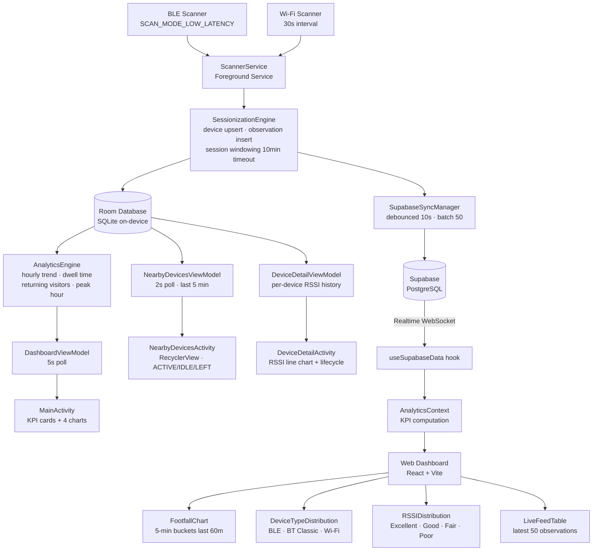

<div align="center">

# Footfall Analytics

### Passive device detection and footfall analysis for physical spaces


</div>

---

## Overview

Footfall Analytics is a two-part system that measures how many people pass by or linger near a physical location — such as a billboard, retail storefront, or event venue — by passively detecting the Bluetooth and Wi-Fi signals emitted by their personal devices.

**The problem it solves:** Traditional footfall counters use cameras or infrared beams requiring line-of-sight. This system needs only an Android phone placed near the target location — no cameras, no infrastructure changes, no privacy invasion.

**Why Bluetooth and Wi-Fi:** Almost everyone carries a smartphone that continuously broadcasts BLE advertising packets and Wi-Fi probe requests. These signals are detectable at 10–30 metres and contain an anonymous MAC address used as a device identifier.

**How analytics are generated:** The Android app collects raw detections, groups them into sessions using a 10-minute inactivity timeout, and computes aggregated metrics — unique visitors, average dwell time, returning visitors, peak hours, and signal strength distribution. These are displayed on-device and synced to a web dashboard in real time via Supabase.

---

## Project Summary

| Property | Value |
|----------|-------|
| Project Name | BillboardAnalytics (Footfall Tracker) |
| Package | `com.example.billboardanalytics` |
| Min SDK | API 30 (Android 11) |
| Target SDK | API 35 |
| Architecture | MVVM + Foreground Service |
| Local Database | Room (SQLite) v2.6.0 |
| Cloud Database | Supabase (PostgreSQL) |
| Android Language | Java 1.8 |
| Dashboard Language | TypeScript + React 19 |
| Build System | Gradle 8.1.1 |

---

## Features

✅ **BLE Continuous Scanning** — Low-latency BLE scan detecting nearby Bluetooth Low Energy devices in real time.

✅ **Wi-Fi Access Point Scanning** — Scans for nearby Wi-Fi access points every 30 seconds (respecting OS throttling).

✅ **Background Foreground Service** — Persistent foreground service with a permanent notification, surviving app minimisation. Compliant with Android 14+ foreground service types.

✅ **Auto-Start on Boot** — Restarts the scanner automatically after device reboot via `BOOT_COMPLETED` broadcast receiver.

✅ **Session-Based Visit Tracking** — Converts raw detections into structured visits with a 10-minute inactivity timeout.

✅ **Local Room Database** — On-device SQLite database via Room with three tables: `devices`, `observations`, and `sessions`.

✅ **Live Dashboard (Android)** — KPI cards (current devices, today's total, returning visitors, average dwell time, peak activity) and 4 live charts, polling every 5 seconds.

✅ **Live Devices Screen** — RecyclerView of devices seen in the last 5 minutes with ACTIVE/IDLE/LEFT status badges, updating every 2 seconds.

✅ **Device Detail Screen** — Full lifecycle profile per device: first/last seen, detection count, average RSSI, session count, dwell time, and RSSI-over-time chart.

✅ **Cloud Sync to Supabase** — Debounced REST API uploads with high-water mark tracking to avoid re-uploading.

✅ **Manual Sync Trigger** — One-tap sync button in the dashboard for out-of-band uploads.

✅ **Web Dashboard** — React + Vite + TypeScript SPA with KPI cards, footfall line chart, device type donut chart, RSSI distribution, and live observation feed.

✅ **Supabase Realtime** — WebSocket subscriptions push new data to the dashboard instantly.

✅ **Debug Log Screen** — Pretty-printed JSON dump of all database records with a clear-all button.

✅ **Data Export** — Share a plain-text analytics summary via any installed app.

✅ **Runtime Permissions** — SDK-version-aware permission requests for API 30, 31+, and 33+.

✅ **Distance Estimation** — RSSI-based distance estimation using the log-distance path loss model.

---

## Architecture



---

## Project Structure

```
BillboardAnalytics/
│
├── app/
│   └── src/main/
│       ├── java/com/example/billboardanalytics/
│       │   ├── data/
│       │   │   ├── AppDatabase.java          # Room singleton, migration registry
│       │   │   ├── AnalyticsDao.java         # All SQL queries (11 methods)
│       │   │   ├── DeviceEntity.java         # devices table
│       │   │   ├── ObservationEntity.java    # observations table
│       │   │   ├── SessionEntity.java        # sessions table
│       │   │   └── Observation.java          # In-memory scan result DTO
│       │   │
│       │   ├── engine/
│       │   │   ├── SessionizationEngine.java # Core processing pipeline
│       │   │   ├── AnalyticsEngine.java      # Metric aggregation
│       │   │   └── FootfallMetrics.java      # Metrics data class
│       │   │
│       │   ├── scanner/
│       │   │   ├── BluetoothScanner.java     # BLE scanning
│       │   │   └── WiFiScanner.java          # Wi-Fi AP scanning
│       │   │
│       │   ├── service/
│       │   │   ├── ScannerService.java       # Foreground service orchestrator
│       │   │   └── BootReceiver.java         # Auto-start on boot
│       │   │
│       │   ├── sync/
│       │   │   └── SupabaseSyncManager.java  # Debounced cloud sync
│       │   │
│       │   ├── ui/
│       │   │   ├── MainActivity.java         # Main dashboard + charts
│       │   │   ├── DashboardViewModel.java   # 5s polling ViewModel
│       │   │   ├── NearbyDevicesActivity.java
│       │   │   ├── NearbyDevicesViewModel.java
│       │   │   ├── NearbyDeviceAdapter.java
│       │   │   ├── NearbyDevice.java         # UI model
│       │   │   ├── DeviceDetailActivity.java
│       │   │   ├── DeviceDetailViewModel.java
│       │   │   └── DebugLogActivity.java
│       │   │
│       │   └── util/
│       │       └── DeviceCategory.java       # Source-of-truth for device categorisation
│       │
│       ├── res/
│       │   ├── layout/
│       │   │   ├── activity_main.xml
│       │   │   ├── activity_nearby_devices.xml
│       │   │   ├── activity_device_detail.xml
│       │   │   ├── activity_debug_log.xml
│       │   │   └── item_nearby_device.xml
│       │   ├── drawable/
│       │   │   ├── bg_badge_active.xml       # Green rounded badge
│       │   │   ├── bg_badge_idle.xml         # Amber rounded badge
│       │   │   └── bg_badge_left.xml         # Red rounded badge
│       │   └── values/
│       │       └── strings.xml               # App name + Supabase credentials
│       │
│       └── AndroidManifest.xml
│
├── billboard-dashboard/
│   └── src/
│       ├── App.tsx                           # Root layout + loading/error states
│       ├── main.tsx                          # React entry point
│       ├── contexts/
│       │   └── AnalyticsContext.tsx          # Global state + KPI computation
│       ├── hooks/
│       │   └── useSupabaseData.ts            # Fetch + Realtime subscriptions
│       ├── components/
│       │   ├── Charts.tsx                    # FootfallChart, DeviceTypeDistribution, RSSIDistribution
│       │   ├── KPICard.tsx                   # Metric tile
│       │   └── LiveFeedTable.tsx             # Latest 50 observations feed
│       ├── lib/
│       │   ├── supabase.ts                   # Supabase client init
│       │   └── utils.ts                      # cn(), estimateDistance(), formatTimeAgo()
│       └── types/
│           └── supabase.ts                   # TypeScript DB schema types
│
└── supabase/
    └── migrations/
        └── 00001_create_tables.sql           # Cloud schema + indexes
```

---

## Database Schema

### On-Device (Room / SQLite)

| Table | Purpose | Key Fields |
|-------|---------|------------|
| `devices` | One row per unique MAC/BSSID ever seen | `id` (PK), `device_identifier` (unique), `source` (BLE/BT_CLASSIC/WIFI), `first_seen`, `last_seen` (ISO-8601 UTC) |
| `observations` | One row per individual scan detection | `id` (PK), `device_id` (FK→devices), `timestamp`, `rssi`, `source` |
| `sessions` | One row per continuous presence window | `id` (PK), `device_id` (FK→devices), `start_time`, `end_time`, `duration` (ms) |

All foreign keys have `ON DELETE CASCADE`.
Indexes: `device_identifier` (unique), `device_id` on observations, `device_id` on sessions.

### Cloud (Supabase / PostgreSQL)

| Table | Key Fields | Indexes |
|-------|-----------|---------|
| `devices` | `id BIGSERIAL PK`, `device_identifier TEXT NOT NULL`, `source TEXT NOT NULL`, `first_seen TIMESTAMPTZ DEFAULT NOW()`, `last_seen TIMESTAMPTZ DEFAULT NOW()` | `idx_devices_identifier`, `idx_devices_last_seen DESC` |
| `observations` | `id BIGSERIAL PK`, `device_id BIGINT FK→devices NOT NULL`, `timestamp TIMESTAMPTZ DEFAULT NOW()`, `rssi INTEGER NOT NULL`, `source TEXT NOT NULL` | `idx_observations_timestamp DESC`, `idx_observations_device_id` |
| `sessions` | `id BIGSERIAL PK`, `device_id BIGINT FK→devices NOT NULL`, `start_time TIMESTAMPTZ DEFAULT NOW()`, `end_time TIMESTAMPTZ DEFAULT NOW()`, `duration BIGINT NOT NULL DEFAULT 0` | `idx_sessions_device_id`, `idx_sessions_start_time DESC` |

> The cloud schema mirrors the on-device schema with all three tables (`devices`, `observations`, `sessions`) for accurate analytics syncing.

---

## Core Modules

<details>
<summary><strong>BluetoothScanner</strong></summary>

Runs `BluetoothLeScanner` with `SCAN_MODE_LOW_LATENCY`. Captures MAC address, RSSI, raw advertisement bytes, and manufacturer data from each scan result.

</details>

<details>
<summary><strong>WiFiScanner</strong></summary>

Uses `WifiManager.startScan()` with a 30-second interval via `Handler`, respecting OS throttling limits. Captures BSSID, SSID, signal level, and frequency per access point.

</details>

<details>
<summary><strong>SessionizationEngine</strong></summary>

Every detection calls `processDetection()` on a single-threaded executor. Steps: fetch or create device → insert observation → update or create session → trigger debounced sync.

</details>

<details>
<summary><strong>AnalyticsEngine</strong></summary>

Polled every 5 seconds. Computes: total visitors, current nearby, returning visitors, average dwell time, peak hour, hourly trend, source distribution, and device category distribution.

</details>

<details>
<summary><strong>SupabaseSyncManager</strong></summary>

Uploads data to Supabase via REST API with upsert semantics. Devices are synced as a full table upsert; observations use a high-water mark for incremental upload (up to 50 rows per batch). Sync is debounced at 10-second intervals.

</details>

<details>
<summary><strong>Web Dashboard</strong></summary>

A React 19 SPA built with Vite and Tailwind CSS v4. Data flows from Supabase through `useSupabaseData` hook into `AnalyticsContext`. Initial load fetches 24 hours of observations and all devices in parallel; Realtime WebSocket subscriptions push live updates. Charts are rendered with Recharts.

</details>

---

## FootfallAnalytics SDK (`sdktest/`)

A standalone Android library wrapping the core scanning, sessionization, and analytics engine for third-party integration.

### Quick Start

```groovy
// settings.gradle
dependencyResolutionManagement {
    repositoriesMode.set(RepositoriesMode.FAIL_ON_PROJECT_REPOS)
    repositories { google(); mavenCentral(); maven { url "https://jitpack.io" } }
}
// app/build.gradle
dependencies { implementation project(':sdktest') }
```

```java
SDKConfig config = new SDKConfig.Builder()
    .setSupabaseUrl("https://YOUR_PROJECT.supabase.co")
    .setSupabaseAnonKey("YOUR_ANON_KEY")
    .build();

FootfallAnalyticsSDK sdk = FootfallAnalyticsSDK.getInstance();
sdk.initialize(this, config);
sdk.setListener(new FootfallListener() { /* callbacks */ });

sdk.startScanning();
FootfallMetrics metrics = sdk.getMetrics();
sdk.stopScanning();
sdk.shutdown();
```

---

## Android Permissions

| Permission | Reason |
|-----------|--------|
| `ACCESS_FINE_LOCATION` | Required by Android to perform Bluetooth and Wi-Fi scanning (OS requirement since API 23) |
| `ACCESS_COARSE_LOCATION` | Fallback location permission also required for scanning APIs |
| `ACCESS_BACKGROUND_LOCATION` | Allows scanning to continue when the app is not in the foreground |
| `BLUETOOTH` / `BLUETOOTH_ADMIN` | Legacy Bluetooth permissions for API ≤ 30 |
| `BLUETOOTH_SCAN` | Bluetooth scanning permission for API 31+ |
| `BLUETOOTH_CONNECT` | Required to read device names on API 31+ |
| `ACCESS_WIFI_STATE` | Read Wi-Fi scan results |
| `CHANGE_WIFI_STATE` | Initiate Wi-Fi scans via `WifiManager.startScan()` |
| `FOREGROUND_SERVICE` | Declare the scanner as a foreground service |
| `FOREGROUND_SERVICE_LOCATION` | Android 14+ typed foreground service — location |
| `FOREGROUND_SERVICE_CONNECTED_DEVICE` | Android 14+ typed foreground service — Bluetooth |
| `RECEIVE_BOOT_COMPLETED` | Auto-start after device reboot |
| `POST_NOTIFICATIONS` | Show the persistent scanning notification on API 33+ |
| `INTERNET` | Upload data to Supabase REST API |

---

## Installation

### Android App

**Requirements:** Android Studio Hedgehog+, device running API 30+, Bluetooth and Wi-Fi enabled.

```bash
git clone https://github.com/your-username/footfall-analytics.git
cd footfall-analytics
```

1. Open the root folder in Android Studio and let Gradle sync
2. Add Supabase credentials to `local.properties`:
   ```properties
   SUPABASE_URL=https://YOUR_PROJECT_ID.supabase.co
   SUPABASE_ANON_KEY=YOUR_SUPABASE_ANON_KEY
   ```
3. Connect your device with USB debugging and run (`Shift+F10`)

### Supabase Setup

1. Create a project at [supabase.com](https://supabase.com)
2. Run the migration from `supabase/migrations/00001_create_tables.sql` in the SQL editor
3. Enable Row Level Security and add anonymous insert/select policies for all three tables
4. Enable Realtime for `devices`, `observations`, and `sessions` under **Database → Replication**
5. Copy your **Project URL** and **anon public key** from **Project Settings → API**

### Web Dashboard

```bash
cd billboard-dashboard
cp .env.local.example .env.local   # Add your Supabase credentials
npm install
npm run dev                        # Development
npm run build                      # Production
```

---

## Screens

### Android App

| Screen | Description |
|--------|-------------|
| **Dashboard** (`MainActivity`) | KPI cards, hourly bar chart, 5-minute line chart, category and protocol pie charts, start/stop/export/sync buttons |
| **Live Devices** (`NearbyDevicesActivity`) | Scrollable list of devices seen in the last 5 minutes with ACTIVE/IDLE/LEFT badges |
| **Device Profile** (`DeviceDetailActivity`) | Full lifecycle view for a single device — MAC, category, first/last seen, detections, average RSSI, sessions, dwell time, RSSI over time chart |
| **Debug Log** (`DebugLogActivity`) | Pretty-printed JSON of the entire Room database with a clear-all button |

### Web Dashboard

| Component | Description |
|-----------|-------------|
| **KPI Row** | Total Devices Seen · Currently Present (5m) · New Devices Today · Total Observations |
| **Footfall Chart** | Line chart of observations and unique devices across the last 60 minutes in 5-minute intervals |
| **Device Types** | Donut chart — Wi-Fi vs BLE vs BT Classic split |
| **RSSI Distribution** | Horizontal bar chart — Excellent / Good / Fair / Poor signal quality bands |
| **Live Feed** | Scrollable table of the 50 most recent observations with type icon, MAC address, RSSI bar, and estimated distance |

---

## Challenges

**Android Bluetooth restrictions** — Android 12+ split Bluetooth permissions. The app handles three separate permission sets depending on SDK version to remain compatible with API 30–36.

**Wi-Fi scan throttling** — Android limits apps to 4 Wi-Fi scans per 2 minutes. The 30-second interval stays safely within this limit.

**MAC address randomisation** — Modern devices randomise their MAC addresses for privacy, making a device appear as new after each cycle. This is an OS-level constraint and the primary source of over-counting in unique visitor metrics.

**Background execution limits** — Android's battery optimisation kills background services. A foreground service with `START_STICKY` is used, but some OEM ROMs (Xiaomi/MIUI, Samsung One UI) may require manual battery whitelist exemption.

**Thread-safe date formatting** — Resolved by using `ThreadLocal<SimpleDateFormat>` across all engine and ViewModel classes.

**Sessionization race condition** — Rapid BLE callbacks for the same MAC could race on device insertion. Handled via `OnConflictStrategy.IGNORE` with a re-fetch when insert returns -1.

---

## Author

**Vaibhav**

A computer science student passionate about building systems that bridge the physical and digital worlds. This project was built end-to-end exploring Android background services, Bluetooth/Wi-Fi scanning, real-time cloud sync, and full-stack analytics.

---

<div align="center">

Built with the Android SDK, Room, Supabase, React, and a lot of Bluetooth packets.

</div>
